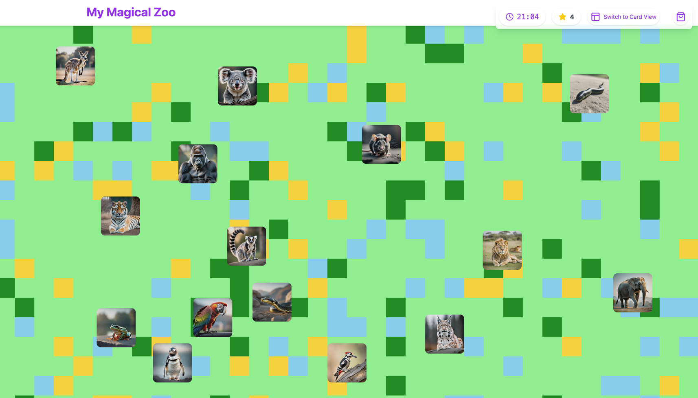

# Latent Space
*Latent Space* is a multi-game game. 

# Demo
You can access the [Latent Space Game](https://main.doiqq8fe0djze.amplifyapp.com/) powerd by [AWS Amplify](https://aws.amazon.com/de/amplify/).  

# Educational Games

This repository contains a collection of educational games designed to enhance learning in Science, Technology, Engineering, and Mathematics (STEM). Below is a table summarizing each game and its educational focus.

| Game                  | Description                                                                                                           |
|-----------------------|-----------------------------------------------------------------------------------------------------------------------|
| Frogger Game          | A classic arcade game where players navigate a frog across a busy road. Enhances problem-solving and strategic thinking. |
| Worm Counting Game    | Count the number of worms on the screen. Develops counting and estimation skills.                                     |
| Letter Defense Game   | Defend against falling letters by typing them. Improves typing speed and accuracy.                                    |
| Maze Game             | Navigate through a maze without touching the walls. Enhances spatial awareness and problem-solving skills.            |
| Drawing Game          | Draw and guess what the drawing represents. Encourages creativity and artistic expression.                            |
| Snake Game            | Control a snake to eat food and grow longer. Teaches reaction speed.                                                                |
| Tree Counting Game    | Count the number of blue trees in a forest. Develops observation and counting skills.                                 |
| Physics Drawing Game  | Draw lines to guide a ball into a bucket using physics. Teaches basic physics concepts and problem-solving.           |
| Elephant Memory Game  | Match pairs of cards to improve memory. Enhances memory and concentration.                                            |
| Letter Catch Game     | Catch falling letters and avoid numbers. Improves hand-eye coordination and quick thinking.                           |
| Penguin Math Game     | Solve math problems to help a penguin. Strengthens arithmetic skills and logical reasoning.                           |
| Tiger Hangman Game    | Guess the word before the tiger is fully drawn. Enhances vocabulary and spelling skills.                              |
| Parrot Decimal Game   | Place decimals on a number line. Develops understanding of decimal numbers and number sense.                          |
| Kangaroo Quiz Game    | Answer quiz questions about kangaroos. Expands knowledge in biology and animal science.                               |
| Lion Fact Game        | Determine if facts about lions are true or false. Enhances critical thinking and knowledge of animal facts.           |
| Gorilla Vocabulary Game | Match words with their meanings. Improves vocabulary and language skills.                                             |

